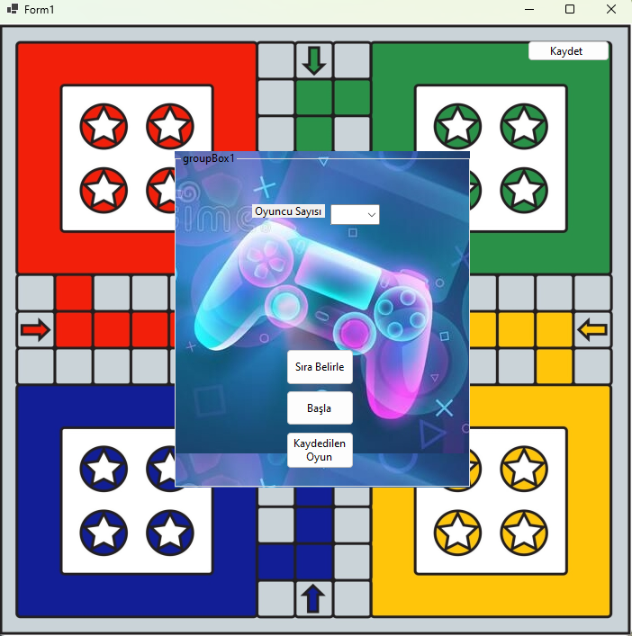

# Kizma Birader Oyunu
 File organization project
 
 
We need to select a minimum of 2 and a maximum of 4 players. After entering their names, sorting process will determine the playing order of the players. This section only displays order of the entered names on the screen, not in-game sequence. The game sequence is fixed as red, yellow, green, blue.
Depending on the number of players, the blue and yellow pawns lose their movement rights. All possible paths that can be taken, including the pawns on the screen, are defined as picture boxes. Players roll the dice in turn, and when a six is rolled, they earn the right to move their pawns out of the nest. The pawns in the game move according to their pawn numbers and the movement buttons in the center. When a movement occur, current picturebox content will be empty and according to dice number we roll, next place is calculated and picturebox content is changed.
 

